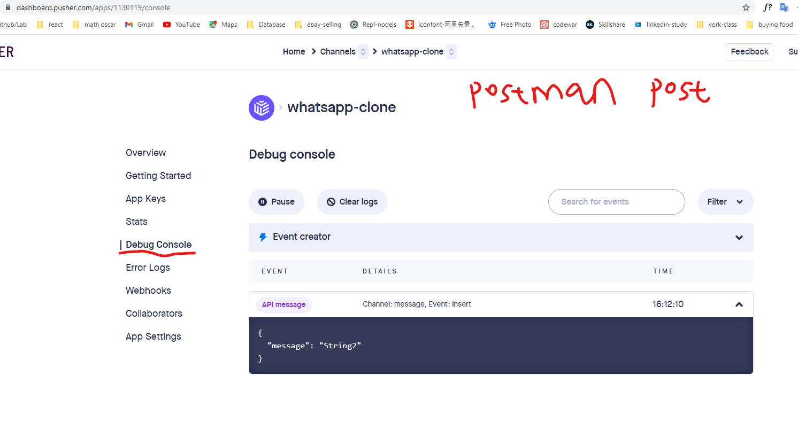
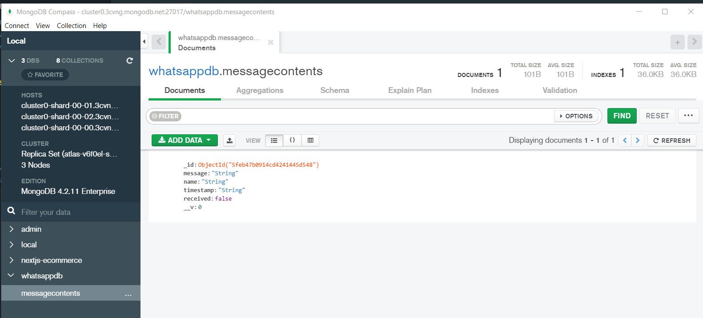

# Full-Stack WhatsApp clone

2020-12-28

- frontend: React, firebase(auth,hosting)

- backend: express(nodejs) mongodb to save chat data

backend package.json -> "type": "module" can make backend also use ES6 syntax import:

Config

```
"dev": "nodemon  --no-warnings --experimental-modules --es-module-specifier-resolution=node server.js"
```

**Pusher** (backend) to replace socket.io to make live chat easier, real time sync.
[https://dashboard.pusher.com/apps/1130119/getting_started]

(using brenda another gmail account to login)



Frontend use **pusher-js**

**Mongodb compass**

